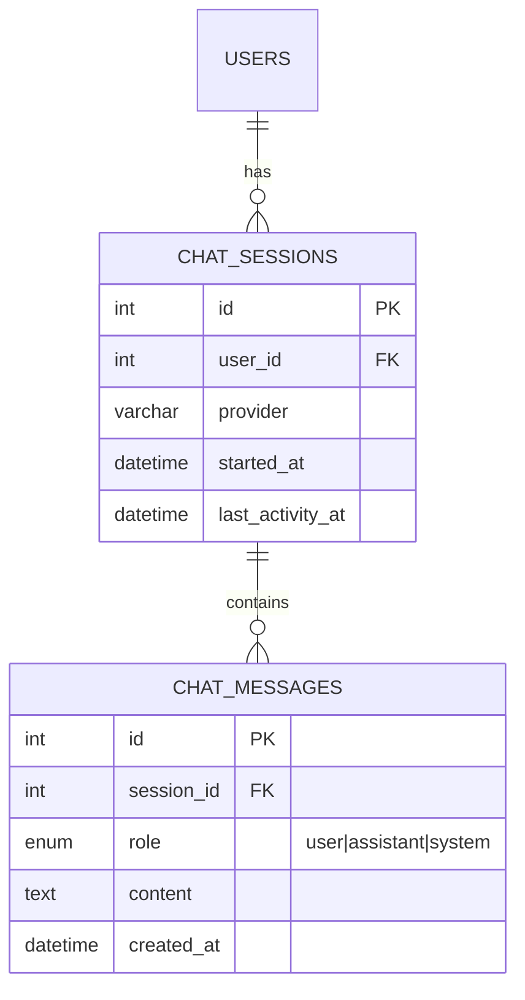

# StayWise ERD

This ERD models the core data for authentication, payments, complaints, announcements, and AI chat metadata.

Assumptions
- Roles are managed via a `role` enum on `users` (tenant, admin)
- Payment statuses: Pending, Verified, Rejected
- Complaint statuses: Open, In Progress, Resolved, Rejected
- Soft deletes not modeled; add `deleted_at` if needed later

```mermaid
erDiagram
    USERS ||--o{ PAYMENTS : submits
    USERS ||--o{ COMPLAINTS : files
    USERS ||--o{ COMPLAINT_NOTES : authored_by
    USERS ||--o{ ANNOUNCEMENTS : posts
  USERS ||--o{ ADMIN_LOGS : performs

    COMPLAINTS ||--o{ COMPLAINT_NOTES : has

    USERS {
      int id PK
      varchar name
      varchar email UK
      varchar password_hash
      enum role "tenant|admin"
      datetime created_at
      datetime updated_at
    }

    PAYMENTS {
      int id PK
      int user_id FK
      decimal amount(10,2)
      varchar method
      varchar reference_no
      enum status "Pending|Verified|Rejected"
      varchar proof_path
      int bill_month "1..12"
      int bill_year
      datetime created_at
      datetime verified_at
    }

    COMPLAINTS {
      int id PK
      int user_id FK
      varchar subject
      text details
      enum status "Open|In Progress|Resolved|Rejected"
      varchar attachment_path
      datetime created_at
      datetime updated_at
      datetime resolved_at
    }

    COMPLAINT_NOTES {
      int id PK
      int complaint_id FK
      int author_user_id FK
      text note
      datetime created_at
    }

    ANNOUNCEMENTS {
      int id PK
      int author_user_id FK
      varchar title
      text body
      enum visibility "all|tenants|admins"
      enum status "published|archived"
      datetime created_at
      datetime updated_at
    }

    ADMIN_LOGS {
      int id PK
      int admin_user_id FK
      varchar action "LOGIN|LOGOUT|VERIFY_PAYMENT|UPDATE_COMPLAINT|POST_ANNOUNCEMENT|ARCHIVE_ANNOUNCEMENT|PROFILE_UPDATE|OTHER"
      varchar entity_type "PAYMENT|COMPLAINT|ANNOUNCEMENT|USER|SYSTEM|NONE"
      int entity_id "nullable"
      text details "optional JSON"
      varchar ip_address
      datetime created_at
    }
```

Keys & Indexes
- USERS.email unique; indexes on USERS.role
- PAYMENTS (user_id, bill_year, bill_month) unique to prevent duplicates
- Foreign keys with ON DELETE RESTRICT (or CASCADE if desired for notes)
- Index COMPLAINTS.status for dashboard filters; PAYMENTS.status for admin queues

Chat metadata (optional)
- If you plan to store chats, add:


